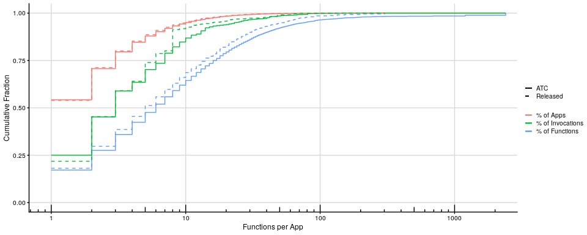
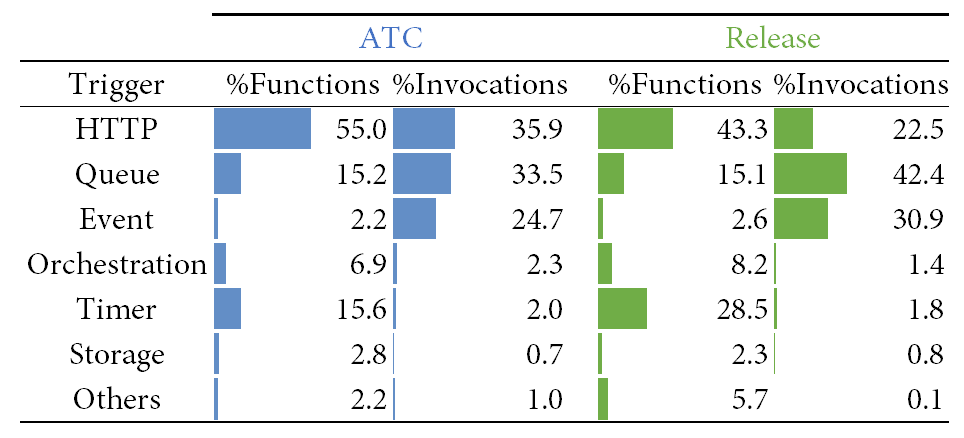
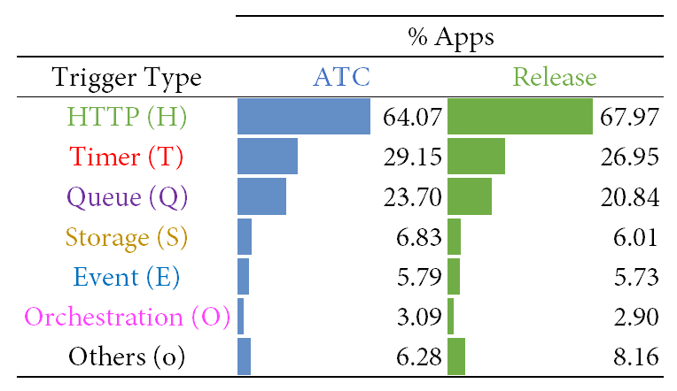
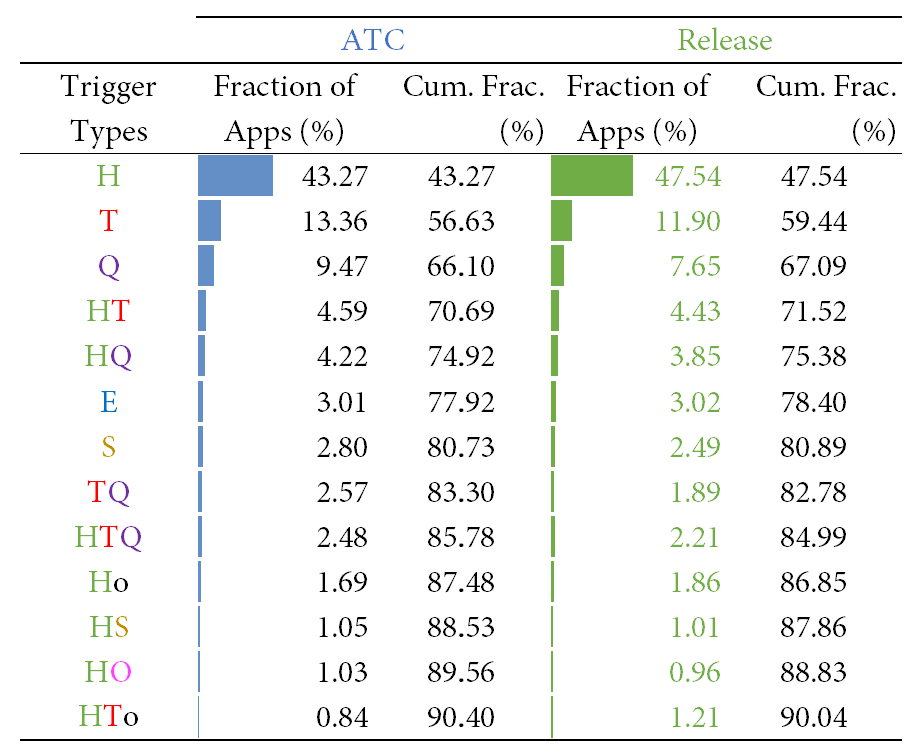
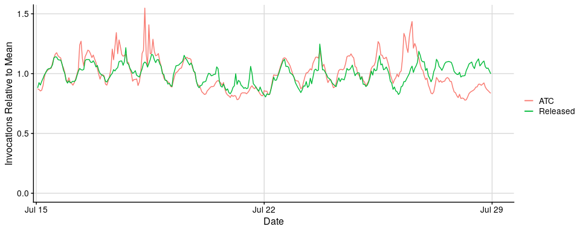
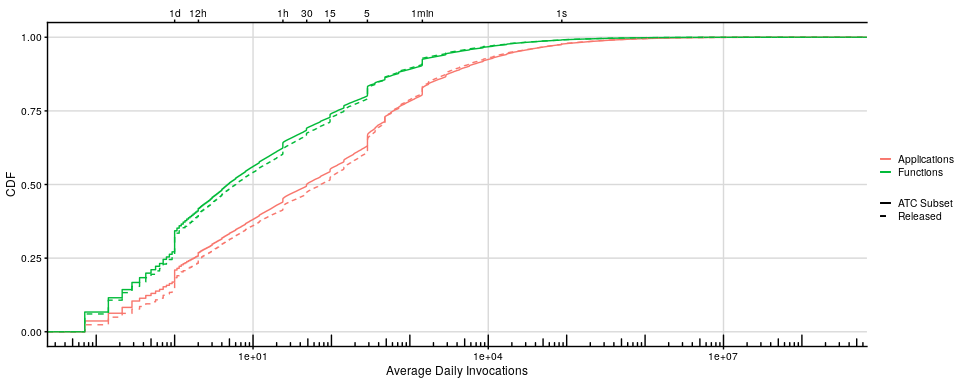
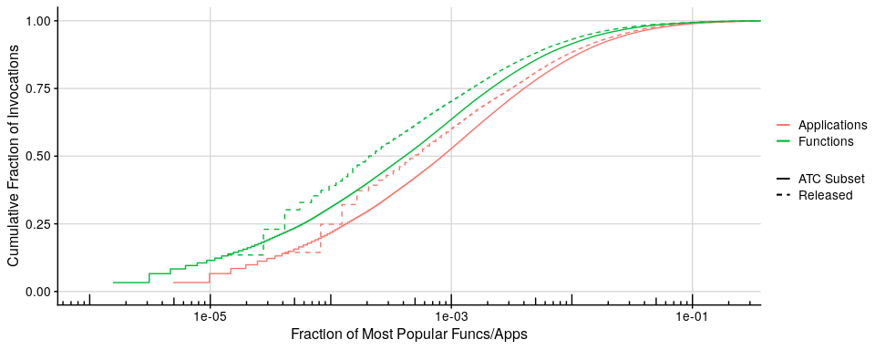
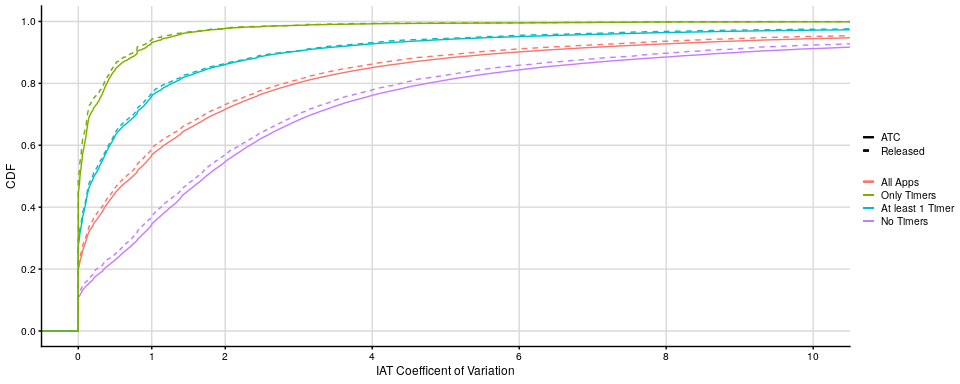
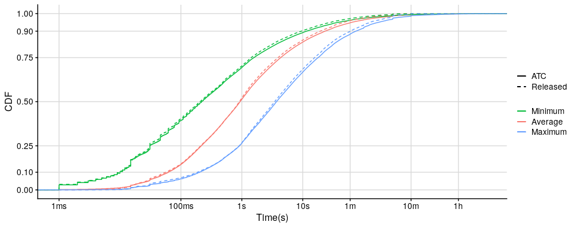
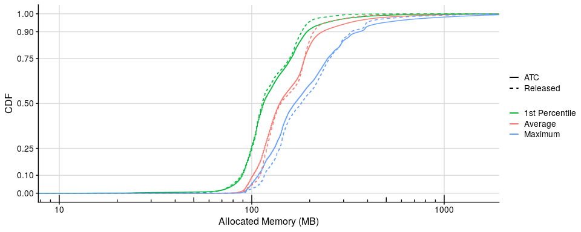

Comparing Azure Function Workloads - Released Trace vs ATC Paper
================

# Introduction

This is an R notebook that compares the released Azure Functions Trace
from 2019 to the traces used in the ATC paper ‘Serverless in the Wild’.
The main goal of this notebook is to show that the released trace is
representative of the dataset used in the paper. For details of the graphs, please refer to the [paper](https://www.microsoft.com/en-us/research/uploads/prod/2020/05/serverless-ATC20.pdf). For details of the trace, please refer to the [trace description](https://github.com/Azure/AzurePublicDataset/blob/master/AzureFunctionsDataset2019.md).

In the graphs that follow, ‘ATC’ means the data that was used in the
paper to produce the corresponding graph, and ‘Released’ means the
released trace. The notebook in some cases does not use the same files
as the release, but instead filters the ATC traces with the list of apps
in the release. **The files in the released trace were produced from the
original traces by filtering with the same list of apps,
list\_of\_release\_apps**. This list was obtained by randomly sampling
applications.

The released trace corresponds to a small and unspecified fraction of
the workload. The dataset used in the paper is, in most graphs, the
whole workload, except for the graphs in Figure 5, where the graphs in
the paper (and here) are also subset of the full trace, albeit larger
than the released trace.

# Initial loading and setup

``` r
library(readr)
library(lubridate)
library(ggplot2)
library(dplyr)
library(cowplot)
library(scales)
```

We ran an external script to aggregate the number of invocations per
function, to avoid having to load the entire invocation time series in
memory.

We also ran an exteral script to aggregate the number of invocations per
hour.

``` r

# List of apps released in the public trace
list_of_release_apps <-
    as_tibble(
      read.csv("list_of_release_apps.csv",
               header=FALSE,
               col.names = c(
                 "SubscriptionId",
                 "AppName",
                 "Plan",
                 "Party"
              )))

# List of apps used for Figure 5 of the ATC paper
atc_subset_of_apps <-
    as_tibble(
      read.csv("list_of_atc_subset.csv",
               header=FALSE,
               col.names = c(
                 "SubscriptionId",
                 "AppName"
              )))  
```

``` r

# Invocations per Function - all functions
invocations_per_function <-
  as_tibble(
    read.csv("atc_invocations_per_func.csv",
      header = FALSE,
      col.names = c(
        "SubscriptionId",
        "AppName",
        "FunctionName",
        "Invocations",
        "AvgInvocationsPerDay"
      )))

# Invocations per Function - released trace
# This file is produced directly from the released invocation* trace files
# Differently from the atc files, in these files HashApp are unique names,
# there is no need to use HashOwner (SubscriptionId) to disambiguate.
release_invocations_per_function <- 
  as_tibble(
    read.csv("release_invocations_per_functions.csv",
      header = FALSE,
      col.names = c(
        "HashApp",
        "HashFunc",
        "Invocations"
      )))

num_days <- 14

release_invocations_per_function <- release_invocations_per_function %>% 
        mutate(AvgInvocationsPerDay = Invocations / num_days)
```

# Number of Functions per App

## Figure 1

Plot the figure in the paper with the added comparison lines. The red
curve is simply a CDF of functions per app. The others are not exactly
CDFs, but can be read, respectively, as ‘fraction of invocations by apps
with at most x functions per app’ (green), and ‘fraction of functions in
apps with at most x functions per app (blue)’.

``` r

# Aggregate into functions and invocations per app
functions_and_invocations_per_app <-
  invocations_per_function %>%
    group_by(SubscriptionId,AppName) %>%
    summarize(Functions = n(), 
              Invocations = sum(Invocations),
              AvgInvocationsPerDay = sum(AvgInvocationsPerDay)) %>%
    ungroup()

release_functions_and_invocations_per_app <-
  release_invocations_per_function %>%
    group_by(HashApp) %>%
    summarize(Functions = n(), 
              Invocations = sum(Invocations),
              AvgInvocationsPerDay = sum(AvgInvocationsPerDay)) %>%
    ungroup()

# Summarize for plotting
functions_and_invocations_per_app_summary <-
  functions_and_invocations_per_app %>%
    group_by(Functions) %>%
    summarize(Apps = n(), Invocations = sum(Invocations)) %>%
    mutate(TotalFunctions = Functions * Apps) %>%
    mutate(AppsCumSum = cumsum(Apps),
           FunctionsCumSum = cumsum(TotalFunctions),
           InvocationsCumSum = cumsum(Invocations)) %>%
    ungroup()

release_functions_and_invocations_per_app_summary <-
  release_functions_and_invocations_per_app %>%
    group_by(Functions) %>%
    summarize(Apps = n(), Invocations = sum(as.numeric(Invocations))) %>%
    mutate(TotalFunctions = Functions * Apps) %>%
    mutate(AppsCumSum = cumsum(Apps),
           FunctionsCumSum = cumsum(TotalFunctions),
           InvocationsCumSum = cumsum(Invocations))

# Plot Figure 1
ggplot() +
  geom_step(data=functions_and_invocations_per_app_summary,
            aes(x = Functions, y = AppsCumSum / max(AppsCumSum),
            color = "% of Apps", linetype = "ATC")) +
  geom_step(data=functions_and_invocations_per_app_summary,
            aes(x = Functions, y = FunctionsCumSum / max(FunctionsCumSum),
            color = "% of Functions", linetype = "ATC")) +
  geom_step(data=functions_and_invocations_per_app_summary,
            aes(x = Functions, y = InvocationsCumSum / max(InvocationsCumSum),
            color = "% of Invocations", linetype = "ATC")) +
  geom_step(data=release_functions_and_invocations_per_app_summary,
            aes(x = Functions, y = AppsCumSum / max(AppsCumSum),
            color = "% of Apps", linetype = "Released")) +
  geom_step(data=release_functions_and_invocations_per_app_summary,
            aes(x = Functions, y = FunctionsCumSum / max(FunctionsCumSum),
            color = "% of Functions", linetype = "Released")) +
  geom_step(data=release_functions_and_invocations_per_app_summary,
            aes(x = Functions, y = InvocationsCumSum / max(InvocationsCumSum),
            color = "% of Invocations", linetype = "Released")) +
  scale_x_log10(breaks=c(1,10,100,1000)) + annotation_logticks(sides = "b") +
  scale_color_manual   (name = "Legend",
                        limits= c("% of Apps","% of Invocations", "% of Functions"),
                        values = c("#F8766D","#00BA38","#619CFF")) +
  scale_linetype_manual(name = "Legend",
                        limits= c("ATC","Released"),
                        values = c("solid","dashed")) +
  coord_cartesian(ylim = c(0, 1), xlim = c(1,2000)) +
  ylab("Cumulative Fraction") + xlab("Functions per App") +
  theme_cowplot(9) +  background_grid() + theme(axis.line.y.right = element_line()) +
  theme(legend.title = element_blank())
```

<!-- -->

# Triggers

## Figure 2 - Functions and Invocations per Trigger

The following tables were computed elsewhere, reusing code and scripts
from the paper, and are included here as images.

These are sorted in the same order as in the paper, by invocations in
the ATC dataset. There are some differences in the mix, due to the
sampling (some funtions with many invocations may have been sampled,
skeweing the trace), but the general trends are
consistent.

<div class="figure" style="text-align: center">



<p class="caption">

Functions and Invocations per Trigger

</p>

</div>

## Figure 3(a) - Apps with at least one of each trigger

This doesn’t add up to 100%, as an app can have several functions with
different trigger
types.

<div class="figure" style="text-align: center">



<p class="caption">

Apps with at least one of each trigger

</p>

</div>

## Figure 3b - Popular Trigger Combinations

This is sorted by the combinations in the paper. We added one more line
to the table, so that the two sides include the 13 most popular trigger
combinations. See the previous figure for colors and names of the
trigger
groups.

<div class="figure" style="text-align: center">



<p class="caption">

Popular Trigger Combinations

</p>

</div>

# Invocations per Hour

## Figure 4

Here we normalize both curves by their respective mean. In the paper,
since we only have one curve, we normalize by the max.

``` r

# Load the Invocations per Hour data

# This data is also derived from the log files, but computed offline to avoid
# loading the entire data in this notebook
invocations_per_hour <-
   as_tibble(read.csv("invocations_per_hour_atc.tsv",
    header = TRUE,
    sep = '\t',
    col.names = c("Hour", "Invocations")
    ))
invocations_per_hour <- invocations_per_hour %>% mutate(Hour =  ymd_hms(Hour))

invocations_per_hour_release <-
  as_tibble(read.csv("invocations_per_hour_release.tsv",
    header = TRUE,
    sep = '\t',
    col.names = c("Hour", "Invocations")
    ))
invocations_per_hour_release <- invocations_per_hour_release %>% mutate(Hour =  ymd_hms(Hour))


avg_ATC <- mean(invocations_per_hour$Invocations)
avg_filtered <- mean(invocations_per_hour_release$Invocations)

ggplot() +
  geom_line(data=invocations_per_hour,
            aes(x = Hour, y = Invocations/avg_ATC,
                color="ATC")) + 
  geom_line(data=invocations_per_hour_release,
            aes(x = Hour, y = Invocations/avg_filtered,
                color="Released")) +   
  coord_cartesian(ylim = c(0,1.5),
                  xlim = ymd_hms(c("2019-07-15 14:00:00","2019-07-28 23:59:00"),tz="UTC")) +
  scale_color_manual (name = "Legend",
                      limits= c("ATC","Released"),
                      values = c("#F8766D","#00BA38")) +
  xlab("Date") +
  ylab("Invocations Relative to Mean") +
   theme_cowplot(12) +  background_grid() + theme(axis.line.y.right = element_line()) +
  theme(legend.title = element_blank())
```

<!-- -->

# CDF of daily invocations per function and application.

## Figure 5(a)

In the two graphs that follow, we are comparing two subsets, one,
larger, used in the paper (atc\_subset\_of\_apps), and one used in the
trace (release\_subset\_of\_apps).

``` r
# We use a subset of the trace in Figures 5(a) and 5(b)
atc_functions_and_invocations_per_app <- functions_and_invocations_per_app %>%
              inner_join(atc_subset_of_apps,
                          by = c("SubscriptionId", "AppName"))
atc_invocations_per_function <- invocations_per_function %>%
              inner_join(atc_subset_of_apps,
                          by = c("SubscriptionId", "AppName"))

# Plot both atc- and release-filtered datasets:
ggplot() +
  stat_ecdf(data = atc_functions_and_invocations_per_app,
            aes(x=AvgInvocationsPerDay,
            color = "Applications", linetype = "ATC Subset")) +
  stat_ecdf(data = atc_invocations_per_function,
            aes(x=AvgInvocationsPerDay,
            color = "Functions", linetype = "ATC Subset")) +
  stat_ecdf(data = release_functions_and_invocations_per_app,
            aes(x=AvgInvocationsPerDay,
            color = "Applications", linetype = "Released")) +
  stat_ecdf(data = release_invocations_per_function,
            aes(x=AvgInvocationsPerDay,
            color = "Functions", linetype = "Released")) +  
  scale_x_log10(sec.axis = sec_axis(~ . ^(-1),
                           breaks=c(1,1/2,1/24,1/48,1/96,1/288,1/1440,1/86400),
                           labels=c("1d","12h","1h","30","15","5","1min","1s"))) + 
  annotation_logticks(sides = "b") +
  scale_color_manual   (name = "Legend",
                        limits= c("Applications","Functions"),
                        values = c("#F8766D","#00BA38")) +
  scale_linetype_manual(name = "Legend",
                        limits= c("ATC Subset","Released"),
                        values = c("solid","dashed")) +
  coord_cartesian(ylim = c(0, 1)) +
  ylab("CDF") + xlab("Average Daily Invocations") +
  theme_cowplot(9) +  background_grid() + theme(axis.line.y.right = element_line()) +
  theme(legend.title = element_blank())
```

<!-- -->

## Figure 5(b)

``` r
# Again, both sets of curves are from different subsets of the full dataset: 
# atc is the subset used in the paper, release is the public trace release.

atc_invocations_per_app_cum <- atc_functions_and_invocations_per_app %>% 
    select(-c(SubscriptionId,AppName,AvgInvocationsPerDay,Functions)) %>%
    arrange(desc(Invocations)) %>%
    mutate(FracInvocations = cumsum(as.numeric(Invocations))/sum(Invocations)) %>%
    mutate(FracApps = row_number() / n())

release_invocations_per_app_cum <- release_functions_and_invocations_per_app %>% 
    select(-c(HashApp,Functions,AvgInvocationsPerDay)) %>%
    arrange(desc(Invocations)) %>%
    mutate(FracInvocations = cumsum(as.numeric(Invocations))/sum(Invocations)) %>%
    mutate(FracApps = row_number() / n())

atc_invocations_per_function_cum <- atc_invocations_per_function %>%
    select(-c(SubscriptionId,AppName,FunctionName,AvgInvocationsPerDay)) %>%
    arrange(desc(Invocations)) %>%
    mutate(FracInvocations = cumsum(as.numeric(Invocations))/sum(Invocations)) %>%
    mutate(FracFunctions = row_number() / n())

release_invocations_per_function_cum <- release_invocations_per_function %>%
    select(-c(HashApp,HashFunc,AvgInvocationsPerDay)) %>%
    arrange(desc(Invocations)) %>%
    mutate(FracInvocations = cumsum(as.numeric(Invocations))/sum(Invocations)) %>%
    mutate(FracFunctions = row_number() / n())

# Plot Figure 5(b)
ggplot() +
    geom_step(data=atc_invocations_per_app_cum,
            aes(x = FracApps, y = FracInvocations,
            color = "Applications", linetype = "ATC Subset")) +
    geom_step(data=release_invocations_per_app_cum,
            aes(x = FracApps, y = FracInvocations,
            color = "Applications", linetype = "Released")) +
    geom_step(data=atc_invocations_per_function_cum,
            aes(x = FracFunctions, y = FracInvocations,
            color = "Functions", linetype = "ATC Subset")) +
    geom_step(data=release_invocations_per_function_cum,
            aes(x = FracFunctions, y = FracInvocations,
            color = "Functions", linetype = "Released")) +
  scale_x_log10() + annotation_logticks(sides = "b") +
  scale_color_manual   (name = "Legend",
                        limits= c("Applications","Functions"),
                        values = c("#F8766D","#00BA38")) +
  scale_linetype_manual(name = "Legend",
                        limits= c("ATC Subset","Released"),
                        values = c("solid","dashed")) +
  coord_cartesian(ylim = c(0, 1), xlim=c(1e-6,0.2)) +
  ylab("Cumulative Fraction of Invocations") + xlab("Fraction of Most Popular Funcs/Apps") +
  theme_cowplot(12) +  background_grid() + theme(axis.line.y.right = element_line()) +
  theme(legend.title = element_blank())
```

<!-- -->

# IAT CV

## Figure 6

This figure plots the coefficient of variation (relative standard
deviation) of the inter-arrival time of the invocations to an
application. A Poisson process (memoryless) would have an exponential
IAT distribution, with a CV of 1. Perfectly periodic invocations (e.g.,
a timer) would have a CV of 0.

``` r
# Read Data. We need iat_data and trigger data
iat_data <-
  as_tibble(read.csv(
    pipe("xzcat IAT_stats_atc.csv.xz"),
    header = TRUE,
    col.names = c( "idx", "SubscriptionId", "AppName", "Min",
      "Max", "Mean", "Std", "Q1", "Median", "Q3")
  ))

triggers_per_app <-
  as_tibble(read.csv(
    pipe("xzcat trigger_groups_per_app_atc.csv.xz | sed 's/::/,/g'"),
    header = TRUE,
    col.names = c(
      "SubscriptionId", "AppName", "Triggers_Bin", "Triggers", "http",
      "timer", "queue", "orchestration", "storage", "event", "others")
  ))

# Again, trigger_groups_per_app_atc.csv.xz is produced by a pre-processing script. 
# All you have to know here is that this file has, in the field Triggers,
# a string that indicates the presence of each of the types of triggers:
#                        H, T, Q, O, S, E, o. 
# An app that as at least one of a type will have the corresponding
# letter in Triggers. E.g., an app that has two http functions, one timer function, and one
# event function, will have the string 'HTE' in triggers. (It is from this file that we
# generated the tables in Figures 3a and 3b above.)

iat_data <- inner_join(iat_data, triggers_per_app, by = c("SubscriptionId", "AppName"))

iat_data <- iat_data %>% mutate(CV = Std/Mean)


filtered_iat_data <- iat_data %>%
                    inner_join(list_of_release_apps, by = c("SubscriptionId", "AppName"))
```

``` r
ggplot() + 
  stat_ecdf(data = iat_data, 
            aes(x = CV, color = "All Apps", linetype = "ATC")) + 
  stat_ecdf(data =iat_data %>% filter(!grepl("T", Triggers)), 
            aes(x = CV, color = "No Timers", linetype = "ATC")) + 
  stat_ecdf(data =iat_data %>% filter(grepl("T", Triggers)), 
            aes(x = CV, color = "At least 1 Timer", linetype = "ATC")) +
  stat_ecdf(data =iat_data %>% filter(Triggers == "T"), 
            aes(x = CV, color = "Only Timers", linetype = "ATC")) +
  ##
  stat_ecdf(data = filtered_iat_data, 
            aes(x = CV, color = "All Apps", linetype = "Released")) + 
  stat_ecdf(data =filtered_iat_data %>% filter(!grepl("T", Triggers)), 
            aes(x = CV, color = "No Timers", linetype = "Released")) + 
  stat_ecdf(data =filtered_iat_data %>% filter(grepl("T", Triggers)), 
            aes(x = CV, color = "At least 1 Timer", linetype = "Released")) +
  stat_ecdf(data =filtered_iat_data %>% filter(Triggers == "T"), 
            aes(x = CV, color = "Only Timers", linetype = "Released")) +
  ##
  scale_color_manual   (name = "Legend",
                        limits= c("All Apps", "Only Timers", "At least 1 Timer", "No Timers"),
                        values = hue_pal()(4)) +
  scale_linetype_manual(name = "Legend",
                        limits= c("ATC", "Released"),
                        values = c("solid","dashed")) +
  coord_cartesian(xlim = c(0, 10), ylim = c(0,1)) + 
  scale_x_continuous(breaks=c(0,1,seq(2,10,2))) +
  scale_y_continuous(breaks=seq(0,1.0,0.2)) +
  xlab("IAT Coefficent of Variation") +
  ylab("CDF") + 
  theme_cowplot(9) + background_grid() + theme(axis.line.y.right = element_line()) + 
  theme(legend.title = element_blank())
```

<!-- -->

# Distribution of Function Execution Times

## Figure 7

``` r

# Load the function durations data
fdurations <- 
    as_tibble(read.csv(pipe("xzcat function_durations_percentiles.d01.atc.csv.xz")), 
    header=TRUE
)

# This filtering is done because there were a few errors data collection, which caused
# the duration to be incorrectly recorded as 0.
fdurations_fixmin <- fdurations %>% 
    select(c(SubscriptionId, AppName, Average,Minimum,Maximum)) %>% 
    na.exclude() %>% 
    filter(Average > 0 & Minimum > 0 & Maximum > 0)

# Filter by the list of release apps
fdurations_fixmin_release <- fdurations_fixmin %>%
        inner_join(list_of_release_apps, by = c("SubscriptionId", "AppName"))


log_time_labels <- c("1ms","100ms","1s","10s","1m","10m","1h","10h","1d")
log_time_breaks <- c(0.001,0.1,1,10,60,600,3600,36000,86400)


ggplot() + 
  stat_ecdf(data=fdurations_fixmin,
            aes(x=Average/1000.0, color = "Average", linetype = "ATC")) + 
  stat_ecdf(data=fdurations_fixmin,
            aes(x=Minimum/1000.0, color = "Minimum", linetype = "ATC")) +
  stat_ecdf(data=fdurations_fixmin,
            aes(x=Maximum/1000.0, color = "Maximum", linetype = "ATC")) + 
  stat_ecdf(data=fdurations_fixmin_release,
            aes(x=Average/1000.0, color = "Average", linetype = "Released")) + 
  stat_ecdf(data=fdurations_fixmin_release,
            aes(x=Minimum/1000.0, color = "Minimum", linetype = "Released")) +
  stat_ecdf(data=fdurations_fixmin_release,
            aes(x=Maximum/1000.0, color = "Maximum", linetype = "Released")) + 
  scale_x_log10(breaks=log_time_breaks,labels=log_time_labels) + 
  scale_y_continuous(breaks=c(0,.1,.25,.5,.75,.9,1)) + 
  #define order and unify legends - same name and same limits
  scale_color_manual   (name = "Legend", 
                        limits= c("Minimum","Average","Maximum"),
                        values = c("#00BA38","#F8766D","#619CFF")) +
  scale_linetype_manual(name = "Legend", 
                        limits= c("ATC","Released"),
                        values = c("solid","dashed")) +
  xlab('Time(s)') + 
  ylab('CDF') +
  coord_cartesian(xlim = c(0.001,10000)) + 
  theme_cowplot(12) + background_grid() + theme(axis.line.y.right = element_line()) +
  theme(legend.title = element_blank())
```

<!-- -->

# Distribution of Allocated Memory per Application

## Figure 8

``` r
# Load the data
fmem <- 
    as_tibble(
        read.csv("app_memory_with_percentiles_and_workers_atc-flat.d01.csv", 
                 header=TRUE)
        )
fmem <- fmem %>% 
                 filter(SubscriptionId != "FunctionsWarmupSub") %>%
                 filter(AverageCommitMb_p1 > 0)

fmem_filtered <- fmem %>%
                  inner_join(list_of_release_apps,
                            by=c("SubscriptionId","AppName"))

#Plot
ggplot() + 
    stat_ecdf(data=fmem,
              aes(x=AverageCommitMb, color = "Average", linetype = "ATC")) +
    stat_ecdf(data=fmem,
              aes(x=AverageCommitMb_p1, color = "1st Percentile", linetype = "ATC")) +
    stat_ecdf(data=fmem,
              aes(x=AverageCommitMb_max, color = "Maximum", linetype = "ATC")) + 
    stat_ecdf(data=fmem_filtered,
              aes(x=AverageCommitMb, color = "Average", linetype = "Released")) +
    stat_ecdf(data=fmem_filtered,
              aes(x=AverageCommitMb_p1, color = "1st Percentile", linetype = "Released")) +
    stat_ecdf(data=fmem_filtered,
              aes(x=AverageCommitMb_max, color = "Maximum", linetype = "Released")) + 
    scale_x_log10() +
    scale_y_continuous(breaks=c(0,.1,.25,.5,.75,.9,1)) + 
    coord_cartesian(xlim=c(10,1500)) + 
    scale_color_manual   (name = "Legend", 
                        limits= c("1st Percentile","Average","Maximum"),
                        values = c("#00BA38","#F8766D","#619CFF")) +
    scale_linetype_manual(name = "Legend", 
                        limits= c("ATC","Released"),
                        values = c("solid","dashed")) +
    theme_cowplot(12) + background_grid() + theme(axis.line.y.right = element_line()) +
    theme(legend.title = element_blank()) + 
    annotation_logticks(sides="b") + 
    xlab("Allocated Memory (MB)") +
    ylab("CDF")
```

<!-- -->
